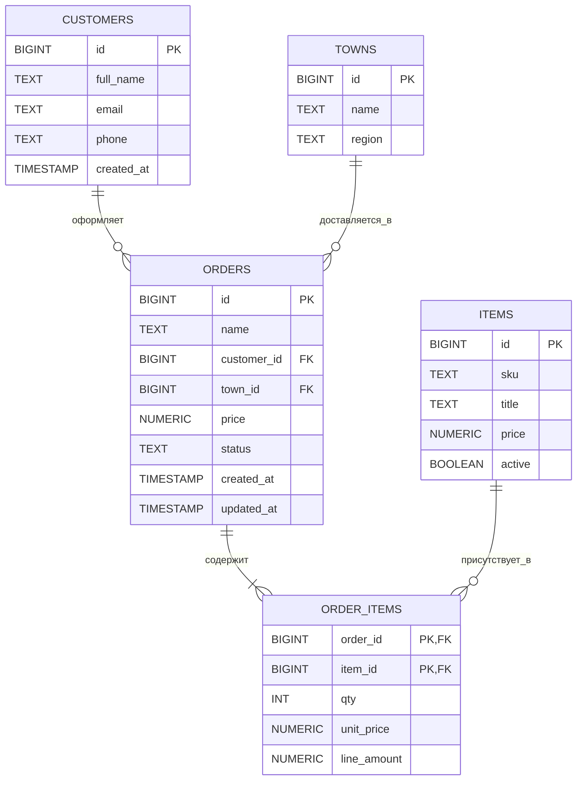
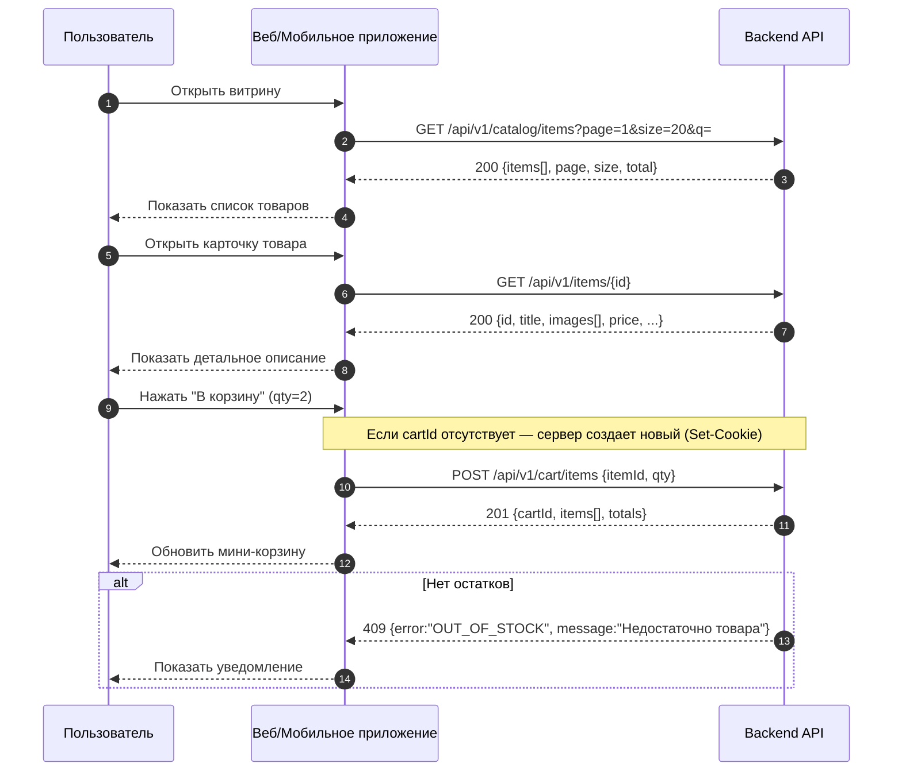

# system-analyst-test
Тестовое задание для компании Effective Mobile
Базы данных — тест

1) Содержит ли какую-то информацию таблица, в которой нет полей?
Ответ: 3. Таблица без полей существовать не может

3) В записи файла реляционной БД может содержаться:
Ответ: 4. Неоднородная информация (данные разных типов)

3)Чем первичный ключ отличается от внешнего ключа?
Ответ: 2. Значения первичного ключа всегда должны быть уникальными и не могут быть null, значения внешнего ключа могут повторяться. И 4. Первичный ключ является идентификатором для строки, а внешний ключ используется для связывания таблиц
(2,4)

4)В какой нормальной форме говорится о том, что все атрибуты зависят от первичного ключа, а не от его части?
Ответ: 2. 2НФ

5)В каком порядке в СУБД выполняются операторы SELECT, FROM, GROUP BY?
Ответ: 4. Сначала FROM, потом GROUP BY и только потом SELECT

6)Чем отличается оператор WHERE от HAVING
Ответ: 2. Оператор HAVING применяется для фильтрации групп, а WHERE - для фильтрации отдельных строк

7) Какой результат покажет выполнение операторов SELECT COUNT (*)?
Ответ: 3. Число строк таблицы, указанной во FROM, включая значение NULL

8) В таблице «Animals» базы данных зоопарка содержится информация обо всех обитающих там животных, в том числе о лисах: red fox, grey fox, little fox. Напишите запрос, возвращающий информацию о возрасте лис
Ответ: 1. SELECT age FROM Animals WHERE Animal LIKE “%fox”

9)Чем отличается DELETE от TRUNCATE?
Ответ: 2. DELETE используется для удаления одной или нескольких строк из таблицы, а TRUNCATE используется для удаления всех строк из таблицы. И
3. DELETE может использовать условие WHERE, а TRUNCATE всегда удаляет все записи из таблицы
(2,3)

10)Дана таблица:

COLOR 
BLUE
RED
null
RED

Каким будет результат запроса?
SELECT COUNT (DISTINCT color) FROM Table

Ответ:4. Результат запроса будет 2

**Задание 2. Базы данных - ER**


## Задание 3. Интеграции

### 3.1 Витрина (список товаров)

**GET** `/api/v1/catalog/items?q=&category=&page=1&size=20&sort=-popularity&priceMin=&priceMax=&inStock=true`  
**200 OK**
```json
{
  "items": [
    {
      "id": 101,
      "sku": "FOX-TOY-RD",
      "title": "Игрушка Red Fox",
      "short": "Мягкая лиса 20 см",
      "price": 1990.0,
      "currency": "RUB",
      "thumbUrl": "/img/items/101-thumb.jpg",
      "rating": 4.7,
      "reviewCount": 126,
      "inStock": true,
      "badges": ["hit", "new"]
    }
  ],
  "page": 1,
  "size": 20,
  "total": 250
}
```

**Параметры:**
- `q` — строка поиска; `category` — слаг/ID категории.
- `page` (≥1), `size` (1–100).
- `sort` — поле с префиксом `-` для убывания (например, `-popularity`, `price`).
- `priceMin`, `priceMax` — фильтр по цене.
- `inStock` — `true|false`.

---

### 3.2 Карточка товара

**GET** `/api/v1/items/{id}`  
**200 OK**
```json
{
  "id": 101,
  "sku": "FOX-TOY-RD",
  "title": "Игрушка Red Fox",
  "description": "Плюшевая лиса, гипоаллергенный наполнитель. Мягкая и приятная на ощупь. Длина игрушки: 20 см.",
  "images": ["/img/items/101-1.jpg", "/img/items/101-2.jpg"],
  "price": 1990.0,
  "listPrice": 2290.0,
  "currency": "RUB",
  "inStock": true,
  "stock": 42,
  "attributes": { "color": "red", "size": "20cm", "material": "plush" },
  "category": ["Игрушки", "Мягкие"],
  "delivery": { "available": true, "estimateDays": "2-4" }
}
```

**Ошибки**  
`404 Not Found`
```json
{ "error": "NOT_FOUND", "message": "Товар не найден" }
```

---

### 3.3 Добавление товара в корзину

**POST** `/api/v1/cart/items`  
**Headers (рекомендуется):**  
- `Idempotency-Key: <uuid>` — защита от повторного добавления при ретраях.

**Body**
```json
{ "itemId": 101, "qty": 2 }
```

**201 Created**
```json
{
  "cartId": "c-abc123",
  "items": [
    {
      "lineId": "l-1",
      "itemId": 101,
      "title": "Игрушка Red Fox",
      "sku": "FOX-TOY-RD",
      "qty": 2,
      "unitPrice": 1990.0,
      "lineAmount": 3980.0,
      "currency": "RUB",
      "thumbUrl": "/img/items/101-thumb.jpg"
    }
  ],
  "totals": {
    "items": 3980.0,
    "discounts": 0.0,
    "shipping": 0.0,
    "tax": 0.0,
    "total": 3980.0,
    "currency": "RUB"
  },
  "updatedAt": "2025-11-06T15:00:00Z"
}
```

**Ошибки**

`400 Bad Request`
```json
{ "error": "BAD_REQUEST", "message": "qty должен быть > 0" }
```

`404 Not Found`
```json
{ "error": "NOT_FOUND", "message": "Товар не найден" }
```

`409 Conflict`
```json
{ "error": "OUT_OF_STOCK", "message": "Недостаточно товара на складе (itemId=101)" }
```

---

### 3.4 Sequence UML (витрина → карточка → корзина)


