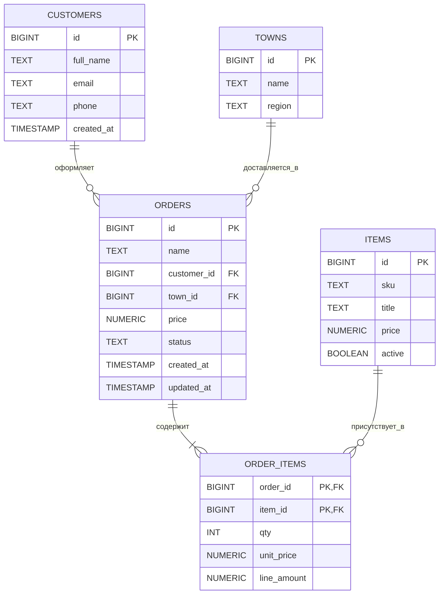
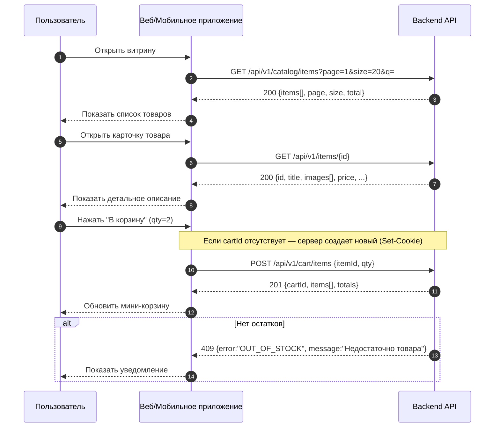

# system-analyst-test
Тестовое задание для компании Effective Mobile
Базы данных — тест

1) Содержит ли какую-то информацию таблица, в которой нет полей?
Ответ: 3. Таблица без полей существовать не может

3) В записи файла реляционной БД может содержаться:
Ответ: 4. Неоднородная информация (данные разных типов)

3)Чем первичный ключ отличается от внешнего ключа?
Ответ: 2. Значения первичного ключа всегда должны быть уникальными и не могут быть null, значения внешнего ключа могут повторяться. И 4. Первичный ключ является идентификатором для строки, а внешний ключ используется для связывания таблиц
(2,4)

4)В какой нормальной форме говорится о том, что все атрибуты зависят от первичного ключа, а не от его части?
Ответ: 2. 2НФ

5)В каком порядке в СУБД выполняются операторы SELECT, FROM, GROUP BY?
Ответ: 4. Сначала FROM, потом GROUP BY и только потом SELECT

6)Чем отличается оператор WHERE от HAVING
Ответ: 2. Оператор HAVING применяется для фильтрации групп, а WHERE - для фильтрации отдельных строк

7) Какой результат покажет выполнение операторов SELECT COUNT (*)?
Ответ: 3. Число строк таблицы, указанной во FROM, включая значение NULL

8) В таблице «Animals» базы данных зоопарка содержится информация обо всех обитающих там животных, в том числе о лисах: red fox, grey fox, little fox. Напишите запрос, возвращающий информацию о возрасте лис
Ответ: 1. SELECT age FROM Animals WHERE Animal LIKE “%fox”

9)Чем отличается DELETE от TRUNCATE?
Ответ: 2. DELETE используется для удаления одной или нескольких строк из таблицы, а TRUNCATE используется для удаления всех строк из таблицы. И
3. DELETE может использовать условие WHERE, а TRUNCATE всегда удаляет все записи из таблицы
(2,3)

10)Дана таблица:

COLOR 
BLUE
RED
null
RED

Каким будет результат запроса?
SELECT COUNT (DISTINCT color) FROM Table

Ответ:4. Результат запроса будет 2

**Задание 2. Базы данных - ER**


## Задание 3. Интеграции

### 3.1 Витрина (список товаров)

**GET** `/api/v1/catalog/items?q=&category=&page=1&size=20&sort=-popularity&priceMin=&priceMax=&inStock=true`  
**200 OK**
```json
{
  "items": [
    {
      "id": 101,
      "sku": "FOX-TOY-RD",
      "title": "Игрушка Red Fox",
      "short": "Мягкая лиса 20 см",
      "price": 1990.0,
      "currency": "RUB",
      "thumbUrl": "/img/items/101-thumb.jpg",
      "rating": 4.7,
      "reviewCount": 126,
      "inStock": true,
      "badges": ["hit", "new"]
    }
  ],
  "page": 1,
  "size": 20,
  "total": 250
}
```
---

### 3.2 Карточка товара

**GET** `/api/v1/items/{id}`  
**200 OK**
```json
{
  "id": 101,
  "sku": "FOX-TOY-RD",
  "title": "Игрушка Red Fox",
  "description": "Плюшевая лиса, гипоаллергенный наполнитель. Мягкая и приятная на ощупь. Длина игрушки: 20 см.",
  "images": ["/img/items/101-1.jpg", "/img/items/101-2.jpg"],
  "price": 1990.0,
  "listPrice": 2290.0,
  "currency": "RUB",
  "inStock": true,
  "stock": 42,
  "attributes": { "color": "red", "size": "20cm", "material": "plush" },
  "category": ["Игрушки", "Мягкие"],
  "delivery": { "available": true, "estimateDays": "2-4" }
}
```

**Ошибки**  
`404 Not Found`
```json
{ "error": "NOT_FOUND", "message": "Товар не найден" }
```

---

### 3.3 Добавление товара в корзину

**POST** `/api/v1/cart/items`  

**Body**
```json
{ "itemId": 101, "qty": 2 }
```

**201 Created**
```json
{
  "cartId": "c-abc123",
  "items": [
    {
      "lineId": "l-1",
      "itemId": 101,
      "title": "Игрушка Red Fox",
      "sku": "FOX-TOY-RD",
      "qty": 2,
      "unitPrice": 1990.0,
      "lineAmount": 3980.0,
      "currency": "RUB",
      "thumbUrl": "/img/items/101-thumb.jpg"
    }
  ],
  "totals": {
    "items": 3980.0,
    "discounts": 0.0,
    "shipping": 0.0,
    "tax": 0.0,
    "total": 3980.0,
    "currency": "RUB"
  },
  "updatedAt": "2025-11-06T15:00:00Z"
}
```

**Ошибки**

`400 Bad Request`
```json
{ "error": "BAD_REQUEST", "message": "qty должен быть > 0" }
```

`404 Not Found`
```json
{ "error": "NOT_FOUND", "message": "Товар не найден" }
```

`409 Conflict`
```json
{ "error": "OUT_OF_STOCK", "message": "Недостаточно товара на складе (itemId=101)" }
```

---

### 3.4 Sequence UML (витрина → карточка → корзина)



Задание 4. Алгоритмическое мышление

<?xml version="1.0" encoding="UTF-8"?>
<bpmn:definitions xmlns:xsi="http://www.w3.org/2001/XMLSchema-instance"
  xmlns:bpmn="http://www.omg.org/spec/BPMN/20100524/MODEL"
  xmlns:bpmndi="http://www.omg.org/spec/BPMN/20100524/DI"
  xmlns:di="http://www.omg.org/spec/DD/20100524/DI"
  xmlns:dc="http://www.omg.org/spec/DD/20100524/DC"
  id="Defs_TopupPhone_001" targetNamespace="https://example.com/bpmn/topup">

  <bpmn:process id="PROC_MobileTopup_100RUB" name="Пополнение баланса телефона на 100₽ через мобильное банковское приложение" isExecutable="false">

    <!-- Пул с дорожками -->
    <bpmn:laneSet id="LaneSet_Main">
      <bpmn:lane id="Lane_User" name="Пользователь">
        <bpmn:flowNodeRef>Start_UserNeed</bpmn:flowNodeRef>
        <bpmn:flowNodeRef>Task_PowerOn</bpmn:flowNodeRef>
        <bpmn:flowNodeRef>Task_Unlock</bpmn:flowNodeRef>
        <bpmn:flowNodeRef>Task_Authenticate</bpmn:flowNodeRef>
        <bpmn:flowNodeRef>Task_SelectTopup</bpmn:flowNodeRef>
        <bpmn:flowNodeRef>Task_InputPhoneAndAmount</bpmn:flowNodeRef>
        <bpmn:flowNodeRef>Task_3DS_Challenge</bpmn:flowNodeRef>
        <bpmn:flowNodeRef>Task_ViewReceipt</bpmn:flowNodeRef>
        <bpmn:flowNodeRef>End_Done</bpmn:flowNodeRef>
      </bpmn:lane>
      <bpmn:lane id="Lane_Device" name="Смартфон / ОС">
        <bpmn:flowNodeRef>Gateway_InternetAvailable</bpmn:flowNodeRef>
        <bpmn:flowNodeRef>Task_EnableConnectivity</bpmn:flowNodeRef>
      </bpmn:lane>
      <bpmn:lane id="Lane_App" name="Мобильное банковское приложение">
        <bpmn:flowNodeRef>Task_LaunchApp</bpmn:flowNodeRef>
        <bpmn:flowNodeRef>Gateway_SessionValid</bpmn:flowNodeRef>
        <bpmn:flowNodeRef>Task_FetchProducts</bpmn:flowNodeRef>
        <bpmn:flowNodeRef>Task_OpenTopupForm</bpmn:flowNodeRef>
        <bpmn:flowNodeRef>Task_ValidateInput</bpmn:flowNodeRef>
        <bpmn:flowNodeRef>Gateway_ValidationOK</bpmn:flowNodeRef>
        <bpmn:flowNodeRef>Task_BuildPaymentRequest</bpmn:flowNodeRef>
        <bpmn:flowNodeRef>Task_ShowDecline</bpmn:flowNodeRef>
        <bpmn:flowNodeRef>Task_ShowSuccess</bpmn:flowNodeRef>
      </bpmn:lane>
      <bpmn:lane id="Lane_Backend" name="Банк (Backend / Платежный шлюз)">
        <bpmn:flowNodeRef>Task_AuthorizePayment</bpmn:flowNodeRef>
        <bpmn:flowNodeRef>Gateway_3DS_Required</bpmn:flowNodeRef>
        <bpmn:flowNodeRef>Gateway_AuthorizationResult</bpmn:flowNodeRef>
        <bpmn:flowNodeRef>Task_ExecutePayment</bpmn:flowNodeRef>
        <bpmn:flowNodeRef>Task_NotifyMNO</bpmn:flowNodeRef>
      </bpmn:lane>
      <bpmn:lane id="Lane_MNO" name="Оператор связи">
        <bpmn:flowNodeRef>Task_ApplyTopup</bpmn:flowNodeRef>
      </bpmn:lane>
    </bpmn:laneSet>

    <!-- Поток управления (основной и альтернативы) -->
    <bpmn:startEvent id="Start_UserNeed" name="Нужно пополнить телефон на 100₽">
      <bpmn:outgoing>Flow_Start_PowerOn</bpmn:outgoing>
    </bpmn:startEvent>

    <bpmn:userTask id="Task_PowerOn" name="Включить смартфон">
      <bpmn:incoming>Flow_Start_PowerOn</bpmn:incoming>
      <bpmn:outgoing>Flow_PowerOn_Unlock</bpmn:outgoing>
    </bpmn:userTask>

    <bpmn:userTask id="Task_Unlock" name="Разблокировать (PIN/FaceID)">
      <bpmn:incoming>Flow_PowerOn_Unlock</bpmn:incoming>
      <bpmn:outgoing>Flow_Unlock_InternetGW</bpmn:outgoing>
    </bpmn:userTask>

    <bpmn:exclusiveGateway id="Gateway_InternetAvailable" name="Есть интернет?">
      <bpmn:incoming>Flow_Unlock_InternetGW</bpmn:incoming>
      <bpmn:incoming>Flow_EnableConnectivity_Back</bpmn:incoming>
      <bpmn:outgoing>Flow_InternetYes_LaunchApp</bpmn:outgoing>
      <bpmn:outgoing>Flow_InternetNo_EnableConnectivity</bpmn:outgoing>
    </bpmn:exclusiveGateway>

    <bpmn:serviceTask id="Task_EnableConnectivity" name="Включить передачу данных / Wi-Fi">
      <bpmn:incoming>Flow_InternetNo_EnableConnectivity</bpmn:incoming>
      <bpmn:outgoing>Flow_EnableConnectivity_Back</bpmn:outgoing>
    </bpmn:serviceTask>

    <bpmn:serviceTask id="Task_LaunchApp" name="Открыть банковское приложение">
      <bpmn:incoming>Flow_InternetYes_LaunchApp</bpmn:incoming>
      <bpmn:outgoing>Flow_LaunchApp_SessionGW</bpmn:outgoing>
    </bpmn:serviceTask>

    <bpmn:exclusiveGateway id="Gateway_SessionValid" name="Сессия действительна?">
      <bpmn:incoming>Flow_LaunchApp_SessionGW</bpmn:incoming>
      <bpmn:outgoing>Flow_SessionYes_FetchProducts</bpmn:outgoing>
      <bpmn:outgoing>Flow_SessionNo_Authenticate</bpmn:outgoing>
    </bpmn:exclusiveGateway>

    <bpmn:userTask id="Task_Authenticate" name="Войти (биометрия / пароль)">
      <bpmn:incoming>Flow_SessionNo_Authenticate</bpmn:incoming>
      <bpmn:outgoing>Flow_Authenticate_FetchProducts</bpmn:outgoing>
    </bpmn:userTask>

    <bpmn:serviceTask id="Task_FetchProducts" name="Загрузить продукты/услуги">
      <bpmn:incoming>Flow_SessionYes_FetchProducts</bpmn:incoming>
      <bpmn:incoming>Flow_Authenticate_FetchProducts</bpmn:incoming>
      <bpmn:outgoing>Flow_FetchProducts_OpenTopup</bpmn:outgoing>
    </bpmn:serviceTask>

    <bpmn:userTask id="Task_SelectTopup" name="Выбрать «Мобильная связь»">
      <bpmn:incoming>Flow_FetchProducts_OpenTopup</bpmn:incoming>
      <bpmn:outgoing>Flow_SelectTopup_OpenForm</bpmn:outgoing>
    </bpmn:userTask>

    <bpmn:serviceTask id="Task_OpenTopupForm" name="Открыть форму пополнения">
      <bpmn:incoming>Flow_SelectTopup_OpenForm</bpmn:incoming>
      <bpmn:outgoing>Flow_OpenForm_Input</bpmn:outgoing>
    </bpmn:serviceTask>

    <bpmn:userTask id="Task_InputPhoneAndAmount" name="Ввести номер телефона и сумму 100₽">
      <bpmn:incoming>Flow_OpenForm_Input</bpmn:incoming>
      <bpmn:outgoing>Flow_Input_Validate</bpmn:outgoing>
    </bpmn:userTask>

    <bpmn:serviceTask id="Task_ValidateInput" name="Проверить формат номера и лимиты/баланс">
      <bpmn:incoming>Flow_Input_Validate</bpmn:incoming>
      <bpmn:outgoing>Flow_Validate_ValidGW</bpmn:outgoing>
    </bpmn:serviceTask>

    <bpmn:exclusiveGateway id="Gateway_ValidationOK" name="Валидация пройдена?">
      <bpmn:incoming>Flow_Validate_ValidGW</bpmn:incoming>
      <bpmn:outgoing>Flow_ValidationYes_BuildReq</bpmn:outgoing>
      <bpmn:outgoing>Flow_ValidationNo_InputAgain</bpmn:outgoing>
    </bpmn:exclusiveGateway>

    <bpmn:serviceTask id="Task_BuildPaymentRequest" name="Сформировать и отправить платёжный запрос">
      <bpmn:incoming>Flow_ValidationYes_BuildReq</bpmn:incoming>
      <bpmn:outgoing>Flow_BuildReq_Authorize</bpmn:outgoing>
      <bpmn:dataOutputAssociation>
        <bpmn:targetRef>Data_PaymentRequest</bpmn:targetRef>
      </bpmn:dataOutputAssociation>
    </bpmn:serviceTask>

    <bpmn:serviceTask id="Task_AuthorizePayment" name="Авторизация платежа (проверка средств/рисков)">
      <bpmn:incoming>Flow_BuildReq_Authorize</bpmn:incoming>
      <bpmn:outgoing>Flow_Authorize_3DS_GW</bpmn:outgoing>
    </bpmn:serviceTask>

    <bpmn:exclusiveGateway id="Gateway_3DS_Required" name="Нужна 3-D Secure?">
      <bpmn:incoming>Flow_Authorize_3DS_GW</bpmn:incoming>
      <bpmn:outgoing>Flow_3DS_Yes_Challenge</bpmn:outgoing>
      <bpmn:outgoing>Flow_3DS_No_AuthResultGW</bpmn:outgoing>
    </bpmn:exclusiveGateway>

    <bpmn:userTask id="Task_3DS_Challenge" name="Подтвердить 3-D Secure (Push/SMS)">
      <bpmn:incoming>Flow_3DS_Yes_Challenge</bpmn:incoming>
      <bpmn:outgoing>Flow_Challenge_BackToResult</bpmn:outgoing>
    </bpmn:userTask>

    <bpmn:exclusiveGateway id="Gateway_AuthorizationResult" name="Авторизация успешна?">
      <bpmn:incoming>Flow_3DS_No_AuthResultGW</bpmn:incoming>
      <bpmn:incoming>Flow_Challenge_BackToResult</bpmn:incoming>
      <bpmn:outgoing>Flow_AuthYes_ExecutePayment</bpmn:outgoing>
      <bpmn:outgoing>Flow_AuthNo_ShowDecline</bpmn:outgoing>
    </bpmn:exclusiveGateway>

    <bpmn:serviceTask id="Task_ExecutePayment" name="Списание и проведение платежа">
      <bpmn:incoming>Flow_AuthYes_ExecutePayment</bpmn:incoming>
      <bpmn:outgoing>Flow_Execute_NotifyMNO</bpmn:outgoing>
    </bpmn:serviceTask>

    <bpmn:serviceTask id="Task_NotifyMNO" name="Уведомить оператора связи (API) ">
      <bpmn:incoming>Flow_Execute_NotifyMNO</bpmn:incoming>
      <bpmn:outgoing>Flow_Notify_ApplyTopup</bpmn:outgoing>
    </bpmn:serviceTask>

    <bpmn:serviceTask id="Task_ApplyTopup" name="Зачислить 100₽ на номер">
      <bpmn:incoming>Flow_Notify_ApplyTopup</bpmn:incoming>
      <bpmn:outgoing>Flow_ApplyTopup_ShowSuccess</bpmn:outgoing>
    </bpmn:serviceTask>

    <bpmn:serviceTask id="Task_ShowSuccess" name="Показать успешный результат и чек">
      <bpmn:incoming>Flow_ApplyTopup_ShowSuccess</bpmn:incoming>
      <bpmn:outgoing>Flow_ShowSuccess_ViewReceipt</bpmn:outgoing>
      <bpmn:dataOutputAssociation>
        <bpmn:targetRef>Data_Receipt</bpmn:targetRef>
      </bpmn:dataOutputAssociation>
    </bpmn:serviceTask>

    <bpmn:userTask id="Task_ViewReceipt" name="Просмотреть/сохранить чек">
      <bpmn:incoming>Flow_ShowSuccess_ViewReceipt</bpmn:incoming>
      <bpmn:outgoing>Flow_Receipt_End</bpmn:outgoing>
    </bpmn:userTask>

    <bpmn:endEvent id="End_Done" name="Готово">
      <bpmn:incoming>Flow_Receipt_End</bpmn:incoming>
    </bpmn:endEvent>

    <bpmn:serviceTask id="Task_ShowDecline" name="Показать отказ/ошибку и рекомендации">
      <bpmn:incoming>Flow_AuthNo_ShowDecline</bpmn:incoming>
      <bpmn:outgoing>Flow_Decline_InputAgain</bpmn:outgoing>
    </bpmn:serviceTask>

    <!-- Объекты данных -->
    <bpmn:dataObjectReference id="Data_PaymentRequest" name="Платёжный запрос" dataObjectRef="DO_PaymentRequest"/>
    <bpmn:dataObject id="DO_PaymentRequest" name="Платёжный запрос"/>
    <bpmn:dataObjectReference id="Data_Receipt" name="Чек (PDF/электронный)" dataObjectRef="DO_Receipt"/>
    <bpmn:dataObject id="DO_Receipt" name="Чек (PDF/электронный)"/>

    <!-- Потоки -->
    <bpmn:sequenceFlow id="Flow_Start_PowerOn" sourceRef="Start_UserNeed" targetRef="Task_PowerOn"/>
    <bpmn:sequenceFlow id="Flow_PowerOn_Unlock" sourceRef="Task_PowerOn" targetRef="Task_Unlock"/>
    <bpmn:sequenceFlow id="Flow_Unlock_InternetGW" sourceRef="Task_Unlock" targetRef="Gateway_InternetAvailable"/>
    <bpmn:sequenceFlow id="Flow_InternetNo_EnableConnectivity" name="Нет" sourceRef="Gateway_InternetAvailable" targetRef="Task_EnableConnectivity"/>
    <bpmn:sequenceFlow id="Flow_EnableConnectivity_Back" sourceRef="Task_EnableConnectivity" targetRef="Gateway_InternetAvailable"/>
    <bpmn:sequenceFlow id="Flow_InternetYes_LaunchApp" name="Да" sourceRef="Gateway_InternetAvailable" targetRef="Task_LaunchApp"/>
    <bpmn:sequenceFlow id="Flow_LaunchApp_SessionGW" sourceRef="Task_LaunchApp" targetRef="Gateway_SessionValid"/>
    <bpmn:sequenceFlow id="Flow_SessionYes_FetchProducts" name="Да" sourceRef="Gateway_SessionValid" targetRef="Task_FetchProducts"/>
    <bpmn:sequenceFlow id="Flow_SessionNo_Authenticate" name="Нет" sourceRef="Gateway_SessionValid" targetRef="Task_Authenticate"/>
    <bpmn:sequenceFlow id="Flow_Authenticate_FetchProducts" sourceRef="Task_Authenticate" targetRef="Task_FetchProducts"/>
    <bpmn:sequenceFlow id="Flow_FetchProducts_OpenTopup" sourceRef="Task_FetchProducts" targetRef="Task_SelectTopup"/>
    <bpmn:sequenceFlow id="Flow_SelectTopup_OpenForm" sourceRef="Task_SelectTopup" targetRef="Task_OpenTopupForm"/>
    <bpmn:sequenceFlow id="Flow_OpenForm_Input" sourceRef="Task_OpenTopupForm" targetRef="Task_InputPhoneAndAmount"/>
    <bpmn:sequenceFlow id="Flow_Input_Validate" sourceRef="Task_InputPhoneAndAmount" targetRef="Task_ValidateInput"/>
    <bpmn:sequenceFlow id="Flow_Validate_ValidGW" sourceRef="Task_ValidateInput" targetRef="Gateway_ValidationOK"/>
    <bpmn:sequenceFlow id="Flow_ValidationYes_BuildReq" name="Да" sourceRef="Gateway_ValidationOK" targetRef="Task_BuildPaymentRequest"/>
    <bpmn:sequenceFlow id="Flow_ValidationNo_InputAgain" name="Нет (исправить данные)" sourceRef="Gateway_ValidationOK" targetRef="Task_InputPhoneAndAmount"/>
    <bpmn:sequenceFlow id="Flow_BuildReq_Authorize" sourceRef="Task_BuildPaymentRequest" targetRef="Task_AuthorizePayment"/>
    <bpmn:sequenceFlow id="Flow_Authorize_3DS_GW" sourceRef="Task_AuthorizePayment" targetRef="Gateway_3DS_Required"/>
    <bpmn:sequenceFlow id="Flow_3DS_Yes_Challenge" name="Да" sourceRef="Gateway_3DS_Required" targetRef="Task_3DS_Challenge"/>
    <bpmn:sequenceFlow id="Flow_3DS_No_AuthResultGW" name="Нет" sourceRef="Gateway_3DS_Required" targetRef="Gateway_AuthorizationResult"/>
    <bpmn:sequenceFlow id="Flow_Challenge_BackToResult" sourceRef="Task_3DS_Challenge" targetRef="Gateway_AuthorizationResult"/>
    <bpmn:sequenceFlow id="Flow_AuthYes_ExecutePayment" name="Одобрено" sourceRef="Gateway_AuthorizationResult" targetRef="Task_ExecutePayment"/>
    <bpmn:sequenceFlow id="Flow_AuthNo_ShowDecline" name="Отказано" sourceRef="Gateway_AuthorizationResult" targetRef="Task_ShowDecline"/>
    <bpmn:sequenceFlow id="Flow_Execute_NotifyMNO" sourceRef="Task_ExecutePayment" targetRef="Task_NotifyMNO"/>
    <bpmn:sequenceFlow id="Flow_Notify_ApplyTopup" sourceRef="Task_NotifyMNO" targetRef="Task_ApplyTopup"/>
    <bpmn:sequenceFlow id="Flow_ApplyTopup_ShowSuccess" sourceRef="Task_ApplyTopup" targetRef="Task_ShowSuccess"/>
    <bpmn:sequenceFlow id="Flow_ShowSuccess_ViewReceipt" sourceRef="Task_ShowSuccess" targetRef="Task_ViewReceipt"/>
    <bpmn:sequenceFlow id="Flow_Receipt_End" sourceRef="Task_ViewReceipt" targetRef="End_Done"/>
    <bpmn:sequenceFlow id="Flow_Decline_InputAgain" sourceRef="Task_ShowDecline" targetRef="Task_InputPhoneAndAmount"/>

  </bpmn:process>


  <bpmndi:BPMNDiagram id="BPMNDiagram_Topup">
    <bpmndi:BPMNPlane id="BPMNPlane_Topup" bpmnElement="PROC_MobileTopup_100RUB"/>
  </bpmndi:BPMNDiagram>
</bpmn:definitions>
